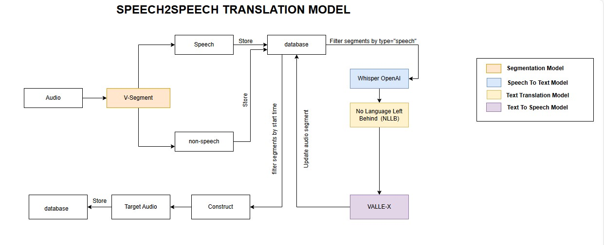

# SPEECH2SPEECH TRANSLATION 
 - Speech-to-speech translation (S2ST) aims at converting speech from one language into speech in    
   another.

## Details
 - S2ST is implemented using cascaded approaches, such as  automatic speech recognition (ASR) to  
   convert spoken words into text, machine translation (MT) to translate the text, and text-to-speech (TTS) synthesis to convert the translated text back into  speech. 

### AI Models
- segmentation model (V-segment)
- automatic speech recognition (Whisper)
- machine translation (No Language Left Behind)
- text to speech (VALL-E-X)

## Technologies
- FASTAPI
- sqlite database
- Natural Language processing
- Large Language Model
- Speech Processing
- Docker

## Framework 
- FASTAPI

## Usage
  git clone https://github.com/Shymaa2611/S2S_API_FastAPI.git
   
  cd S2S_API_FastAPI
   
  pip install -r requirements.txt
   
  uvicorn main:app --reload

### Running
 
  - http://127.0.0.1:8000/docs

### Docker
 
  - docker build -t s2simage .
  - docker run -d --name s2scontainer -p 80:80 s2simage

### Deploy

  

